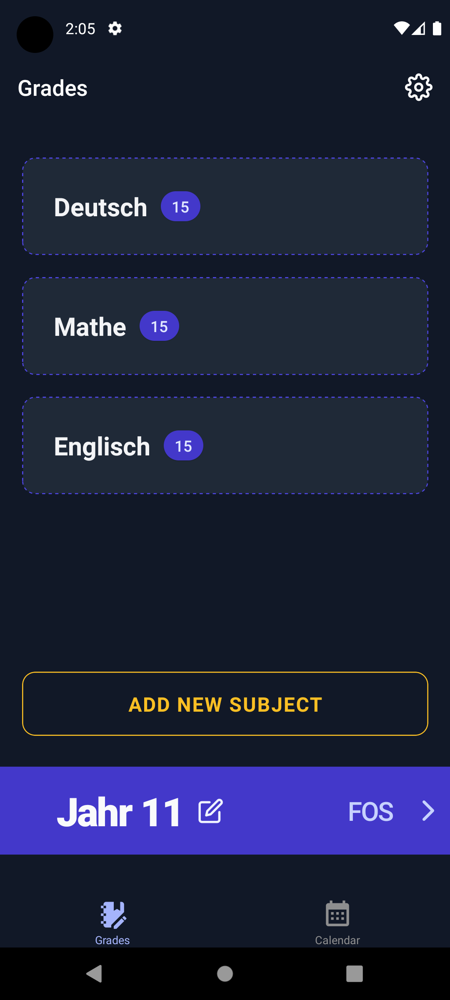
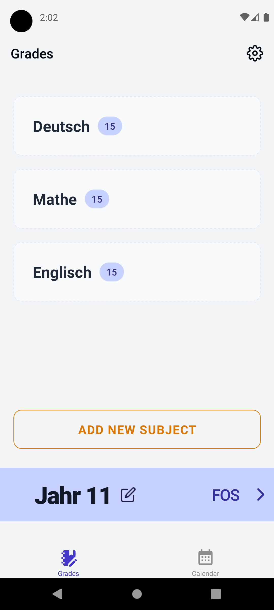

<h1 align="center"> NotenApp </h1> <br>
<p align="center">

</p>

<p align="center">
  Manage your school and university grades.
</p>

## 📝 Table of Contents

- [📝 Table of Contents](#-table-of-contents)
- [🧐 About](#-about)
- [🏁 Getting Started](#-getting-started)
  - [Prerequisites](#prerequisites)
  - [Installing](#installing)
- [🔧 Running the tests](#-running-the-tests)
- [🎈 Usage](#-usage)
- [⛏️ Built Using](#️-built-using)

## 🧐 About

With this app you can organize your school and uni grades and view your current grade average.

## 🏁 Getting Started

These instructions will get you a copy of the project up and running on your local machine for development and testing purposes. See [deployment](#deployment) for notes on how to deploy the project on a live system.

### Prerequisites

Make sure you have installed [Node.js](https://nodejs.org/en/) and [Yarn](https://yarnpkg.com/).
If you use VS Code, I recommend you add the [Expo Tools VS Code extension](https://marketplace.visualstudio.com/items?itemName=expo.vscode-expo-tools).

If you want to generate the app builds using Expo EAS Build, you need to own an Expo Account and install the EAS CLI:

```console
npm install -g eas-cli
```

Then log in to your Expo account:

```console
eas login
```

For building the app locally see [Expo - Local app development](https://docs.expo.dev/guides/local-app-development/).

### Installing

After cloning the repository, install the project's dependencies:

```console
yarn
```

Build a development build of the app:

```console
yarn build-eas-local-dev # Uses EAS locally (only on Linux/MacOS)
```

or:

```console
yarn build-dev # Uses Expo Prebuild
```


Finally, start the development server (if it isn't already running):

```console
yarn dev
```

The development build can now be installed on an emulator or actual device, if it isn't already, and it can connect to the development server.

## 🔧 Running the tests

To run all test suites, run:

```
yarn test
```

## 🎈 Usage

You can see your subjects and their grades at the center of the screen. At the bottom you can either add a new subject or swipe right on the grade to switch to another one.
<p align="center">


</p>

## ⛏️ Built Using

- [Expo](https://expo.dev/) - Mobile Framework and their packages
- [Legend-State](https://github.com/LegendApp/legend-state) - State Management
- [Jest](https://jestjs.io/) - Testing Framework
- [TypeScript](https://www.typescriptlang.org/) - JS Static Typing
